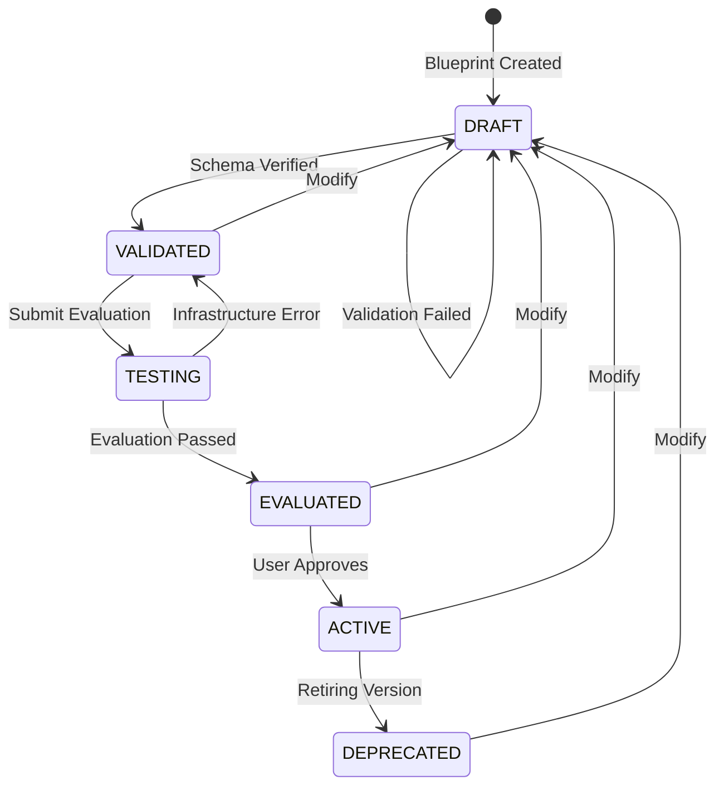

# Agent Lifecycle

Describes the lifecycle of a sub-agent blueprint.

```mermaid
stateDiagram-v2
    [*] --> DRAFT: Blueprint Created
    DRAFT --> VALIDATED: Schema Verified
    DRAFT --> DRAFT: Validation Failed
    VALIDATED --> TESTING: Submit Evaluation
    TESTING --> EVALUATED: Evaluation Passed
    TESTING --> VALIDATED: Infrastructure Error
    EVALUATED --> ACTIVE: User Approves
    ACTIVE --> DEPRECATED: Retiring Version

    EVALUATED --> DRAFT: Modify
    ACTIVE --> DRAFT: Modify
    DEPRECATED --> DRAFT: Modify
    VALIDATED --> DRAFT: Modify
```
