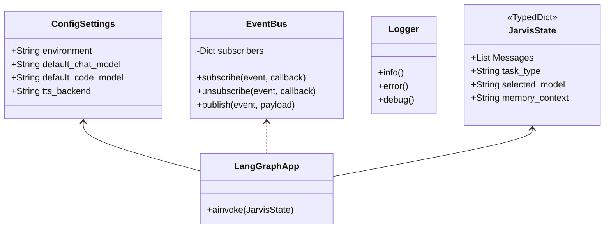

# Chhaya Kernel Architecture

The Core Engine (Kernel) is responsible for routing, state tracking, and event pub/sub.

```mermaid
classDiagram
    class ConfigSettings {
        +String environment
        +String default_chat_model
        +String default_code_model
        +String tts_backend
    }

    class EventBus {
        -Dict subscribers
        +subscribe(event, callback)
        +unsubscribe(event, callback)
        +publish(event, payload)
    }

    class Logger {
        +info()
        +error()
        +debug()
    }

    class JarvisState {
        <<TypedDict>>
        +List Messages
        +String task_type
        +String selected_model
        +String memory_context
    }

    class LangGraphApp {
        +ainvoke(JarvisState)
    }

    ConfigSettings <-- LangGraphApp
    EventBus <.. LangGraphApp
    JarvisState <-- LangGraphApp
```
