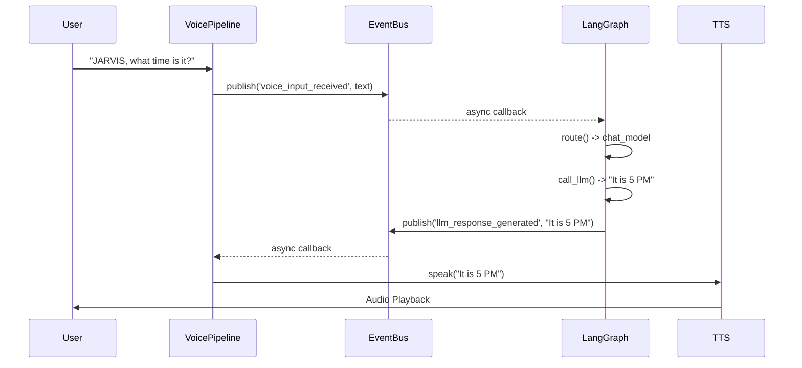

# Event Flow Diagram

Demonstrates how asynchronous events traverse the system.

```mermaid
sequenceDiagram
    participant User
    participant VoicePipeline
    participant EventBus
    participant LangGraph
    participant TTS

    User->>VoicePipeline: "JARVIS, what time is it?"
    VoicePipeline->>EventBus: publish('voice_input_received', text)
    EventBus-->>LangGraph: async callback
    LangGraph->>LangGraph: route() -> chat_model
    LangGraph->>LangGraph: call_llm() -> "It is 5 PM"
    LangGraph->>EventBus: publish('llm_response_generated', "It is 5 PM")
    EventBus-->>VoicePipeline: async callback
    VoicePipeline->>TTS: speak("It is 5 PM")
    TTS->>User: Audio Playback
```
