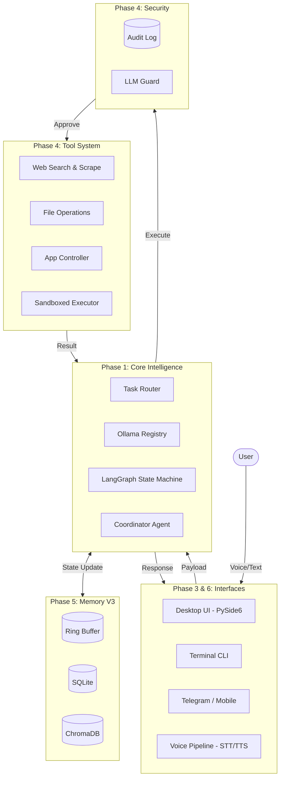

# High-Level System Architecture

This diagram illustrates the macro-level architecture of Chhaya (JARVIS V3), highlighting the separation of interfaces, core intelligence, and external integrations.

