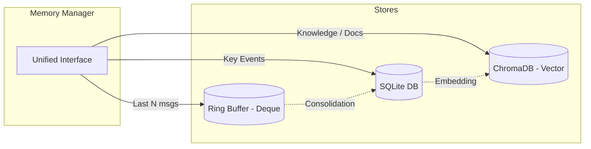

# Memory Architecture

The Memory V3 system blends Short-Term, Episodic, and Semantic memory.

```mermaid
graph LR
    subgraph Memory Manager
        Manager[Unified Interface]
    end

    subgraph Stores
        ShortTerm[(Ring Buffer - Deque)]
        Episodic[(SQLite DB)]
        Semantic[(ChromaDB - Vector)]
    end

    Manager -->|Last N msgs| ShortTerm
    Manager -->|Key Events| Episodic
    Manager -->|Knowledge / Docs| Semantic

    ShortTerm -.-> |Consolidation| Episodic
    Episodic -.-> |Embedding| Semantic
```
