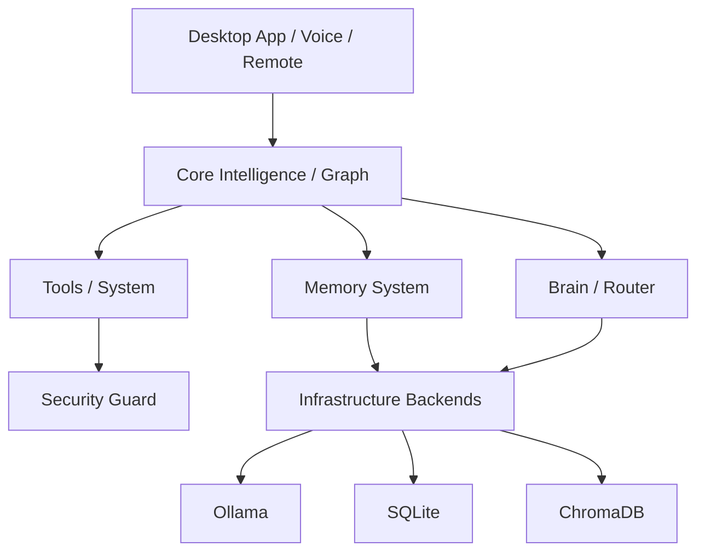

# Package Dependency Diagram

```mermaid
graph TD
    UI[Desktop App / Voice / Remote] --> Core[Core Intelligence / Graph]
    Core --> Tools[Tools / System]
    Core --> Brain[Brain / Router]
    Core --> Memory[Memory System]

    Tools --> Security[Security Guard]
    Memory --> Infra[Infrastructure Backends]
    Brain --> Infra

    Infra --> Ollama
    Infra --> SQLite
    Infra --> ChromaDB
```
