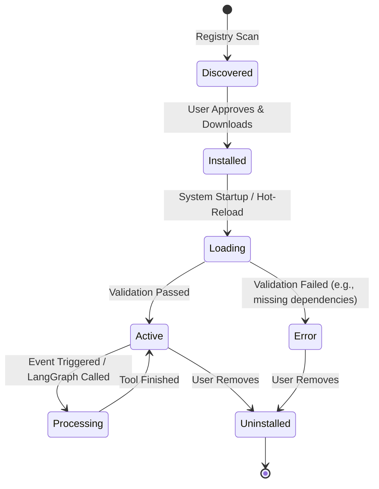

# Plugin Lifecycle

Describes how dynamic tools and skills (Phase 4 & 8) are discovered, installed, and loaded into the system.

```mermaid
stateDiagram-v2
    [*] --> Discovered: Registry Scan
    Discovered --> Installed: User Approves & Downloads
    Installed --> Loading: System Startup / Hot-Reload
    Loading --> Active: Validation Passed
    Loading --> Error: Validation Failed (e.g., missing dependencies)
    Active --> Processing: Event Triggered / LangGraph Called
    Processing --> Active: Tool Finished
    Active --> Uninstalled: User Removes
    Error --> Uninstalled: User Removes
    Uninstalled --> [*]
```
