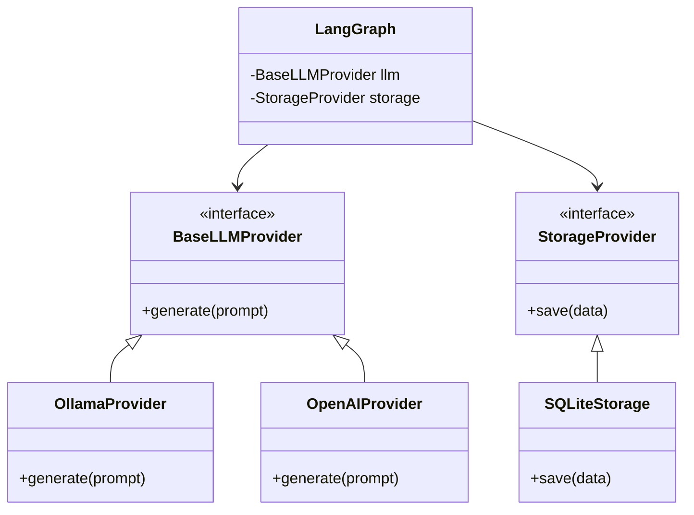

# Provider Abstraction Layer

How infrastructure details are abstracted away from business logic.

```mermaid
classDiagram
    class BaseLLMProvider {
        <<interface>>
        +generate(prompt)
    }
    class OllamaProvider {
        +generate(prompt)
    }
    class OpenAIProvider {
        +generate(prompt)
    }
    BaseLLMProvider <|-- OllamaProvider
    BaseLLMProvider <|-- OpenAIProvider

    class StorageProvider {
        <<interface>>
        +save(data)
    }
    class SQLiteStorage {
        +save(data)
    }
    StorageProvider <|-- SQLiteStorage

    class LangGraph {
        -BaseLLMProvider llm
        -StorageProvider storage
    }

    LangGraph --> BaseLLMProvider
    LangGraph --> StorageProvider
```
